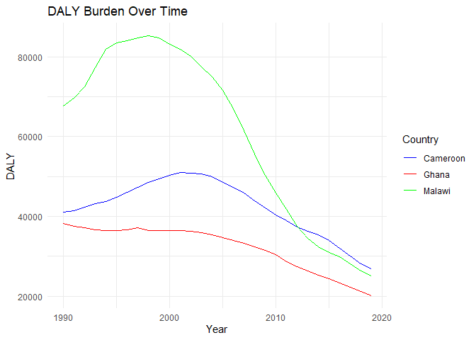
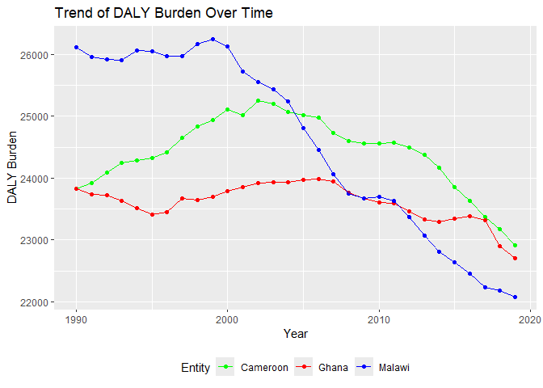
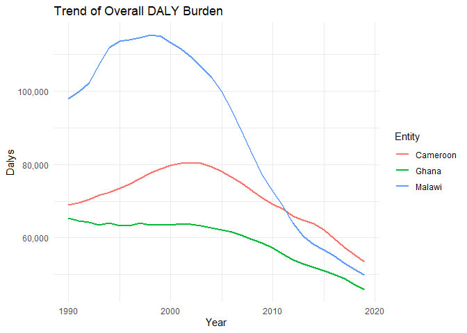

Global Disease Burden Analysis
================
Kevine Tiogouo, Mavis, Ellen and Chifundo Kanjala

# Introduction

This document compares the Disability-Adjusted Life Year (DALY) diseases
burden for three countries: Cameroon, Ghana and Malawi. We compare the
burden due to communicable, maternal, neonatal, and nutritional diseases
(CMNN), non-communicable diseases (NCDs), and overall disease burden for
these countries.

The source data is from the Institute for Health Metrics and Evaluation
(IHME) Global Burden of Disease (GBD) study.

# Communicable, Maternal, Neonatal, and Nutritional Disease Burden (CMNN)

## Table of Estimates for CMNN Burden Over Time

| Year | Cameroon |    Ghana |   Malawi |
|-----:|---------:|---------:|---------:|
| 1990 | 41138.97 | 38169.03 | 67720.68 |
| 1991 | 41501.22 | 37543.84 | 69611.68 |
| 1992 | 42386.18 | 37134.43 | 72425.84 |
| 1993 | 43239.73 | 36581.16 | 77205.15 |
| 1994 | 43789.90 | 36468.65 | 81870.48 |
| 1995 | 44802.07 | 36486.44 | 83523.82 |
| 1996 | 46026.84 | 36604.25 | 84066.40 |
| 1997 | 47234.92 | 37106.98 | 84671.35 |
| 1998 | 48478.10 | 36529.98 | 85203.76 |
| 1999 | 49450.97 | 36491.57 | 84775.65 |
| 2000 | 50332.81 | 36511.40 | 83179.92 |
| 2001 | 50983.40 | 36543.17 | 81972.65 |
| 2002 | 50842.00 | 36337.37 | 80059.14 |
| 2003 | 50674.60 | 35934.13 | 77454.71 |
| 2004 | 49887.67 | 35389.60 | 75049.23 |
| 2005 | 48568.37 | 34746.13 | 71586.95 |
| 2006 | 47215.00 | 34048.81 | 66929.50 |
| 2007 | 45860.13 | 33299.14 | 61515.38 |
| 2008 | 43976.64 | 32442.34 | 55699.27 |
| 2009 | 42111.32 | 31470.54 | 50335.60 |
| 2010 | 40455.95 | 30352.22 | 45957.25 |
| 2011 | 39016.70 | 28746.38 | 41755.34 |
| 2012 | 37393.81 | 27367.24 | 37589.36 |
| 2013 | 36368.89 | 26364.20 | 34434.73 |
| 2014 | 35419.80 | 25361.35 | 32365.33 |
| 2015 | 34056.23 | 24430.32 | 30933.41 |
| 2016 | 32069.77 | 23350.04 | 29834.47 |
| 2017 | 30020.81 | 22336.89 | 28119.98 |
| 2018 | 28132.24 | 21254.46 | 26372.76 |
| 2019 | 26802.97 | 20202.91 | 25068.66 |

## Plot Showing Trends in CMNN Burden Over Time

<!-- -->

## Summary of CMNN Burden Findings

Malawi had the highest burden among the three countries considered in
this analysis from 1990 to 2012. After 2012, Cameroon became the country
with the highest burden of the three. Ghana has constantly maintained
the lowest burden among the three countries thoughout the period of
analysis.

# Non-Communicable Disease Burden (NCD)

## Table of Estimates for NCD Burden Over Time

| Year | Cameroon |    Ghana |   Malawi |
|-----:|---------:|---------:|---------:|
| 1990 | 23834.27 | 23834.64 | 26110.73 |
| 1991 | 23923.30 | 23738.53 | 25958.66 |
| 1992 | 24090.37 | 23729.19 | 25916.86 |
| 1993 | 24248.28 | 23627.99 | 25906.62 |
| 1994 | 24283.03 | 23517.61 | 26069.36 |
| 1995 | 24324.84 | 23414.67 | 26047.46 |
| 1996 | 24420.38 | 23449.32 | 25974.52 |
| 1997 | 24648.36 | 23667.81 | 25977.72 |
| 1998 | 24841.19 | 23648.54 | 26173.10 |
| 1999 | 24933.53 | 23702.79 | 26245.34 |
| 2000 | 25108.66 | 23789.37 | 26124.75 |
| 2001 | 25020.62 | 23860.69 | 25721.95 |
| 2002 | 25258.55 | 23917.47 | 25552.50 |
| 2003 | 25198.23 | 23933.54 | 25440.97 |
| 2004 | 25069.23 | 23933.72 | 25237.83 |
| 2005 | 25012.86 | 23967.60 | 24813.51 |
| 2006 | 24974.57 | 23982.08 | 24457.66 |
| 2007 | 24736.90 | 23947.44 | 24066.02 |
| 2008 | 24599.92 | 23758.24 | 23745.79 |
| 2009 | 24557.26 | 23676.60 | 23676.73 |
| 2010 | 24560.98 | 23608.84 | 23695.54 |
| 2011 | 24576.17 | 23596.51 | 23639.66 |
| 2012 | 24498.33 | 23460.98 | 23378.73 |
| 2013 | 24381.43 | 23332.25 | 23074.74 |
| 2014 | 24164.49 | 23297.30 | 22817.03 |
| 2015 | 23861.86 | 23349.29 | 22639.25 |
| 2016 | 23630.89 | 23380.50 | 22459.70 |
| 2017 | 23367.51 | 23324.08 | 22233.32 |
| 2018 | 23174.43 | 22905.58 | 22179.48 |
| 2019 | 22920.36 | 22702.90 | 22082.07 |

## Plot Showing Trends in NCD Burden Over Time

<!-- -->

## Summary of NCD Burden Findings

The DALY burden of non- communicable diseases rate in Malawi was high
between 1990 and 2000 compared to the other two countries. However,
there was a steep and continuous decline in non-communicable disease
rates from 2000 to 2010. The plot also show a more linear pattern of
change in Ghana with lower DALY burden compared to the other countries.

# Overall Disease Burden

## Table of Estimates for Overall Disease Burden Over Time

<table>
<caption>
Overall DALY Burden
</caption>
<thead>
<tr>
<th style="text-align:right;">
Year
</th>
<th style="text-align:right;">
Cameroon
</th>
<th style="text-align:right;">
Ghana
</th>
<th style="text-align:right;">
Malawi
</th>
</tr>
</thead>
<tbody>
<tr>
<td style="text-align:right;">
1990
</td>
<td style="text-align:right;">
68929.65
</td>
<td style="text-align:right;">
65403.59
</td>
<td style="text-align:right;">
97882.42
</td>
</tr>
<tr>
<td style="text-align:right;">
1991
</td>
<td style="text-align:right;">
69481.74
</td>
<td style="text-align:right;">
64671.89
</td>
<td style="text-align:right;">
99871.76
</td>
</tr>
<tr>
<td style="text-align:right;">
1992
</td>
<td style="text-align:right;">
70568.05
</td>
<td style="text-align:right;">
64200.04
</td>
<td style="text-align:right;">
102367.38
</td>
</tr>
<tr>
<td style="text-align:right;">
1993
</td>
<td style="text-align:right;">
71637.18
</td>
<td style="text-align:right;">
63507.64
</td>
<td style="text-align:right;">
107117.21
</td>
</tr>
<tr>
<td style="text-align:right;">
1994
</td>
<td style="text-align:right;">
72296.72
</td>
<td style="text-align:right;">
63989.91
</td>
<td style="text-align:right;">
111968.46
</td>
</tr>
<tr>
<td style="text-align:right;">
1995
</td>
<td style="text-align:right;">
73505.33
</td>
<td style="text-align:right;">
63252.55
</td>
<td style="text-align:right;">
113576.19
</td>
</tr>
<tr>
<td style="text-align:right;">
1996
</td>
<td style="text-align:right;">
74680.32
</td>
<td style="text-align:right;">
63277.94
</td>
<td style="text-align:right;">
113979.33
</td>
</tr>
<tr>
<td style="text-align:right;">
1997
</td>
<td style="text-align:right;">
76180.62
</td>
<td style="text-align:right;">
64038.00
</td>
<td style="text-align:right;">
114548.05
</td>
</tr>
<tr>
<td style="text-align:right;">
1998
</td>
<td style="text-align:right;">
77749.43
</td>
<td style="text-align:right;">
63422.87
</td>
<td style="text-align:right;">
115263.66
</td>
</tr>
<tr>
<td style="text-align:right;">
1999
</td>
<td style="text-align:right;">
78779.13
</td>
<td style="text-align:right;">
63481.72
</td>
<td style="text-align:right;">
114929.63
</td>
</tr>
<tr>
<td style="text-align:right;">
2000
</td>
<td style="text-align:right;">
79860.98
</td>
<td style="text-align:right;">
63569.57
</td>
<td style="text-align:right;">
113194.41
</td>
</tr>
<tr>
<td style="text-align:right;">
2001
</td>
<td style="text-align:right;">
80371.50
</td>
<td style="text-align:right;">
63813.70
</td>
<td style="text-align:right;">
111499.98
</td>
</tr>
<tr>
<td style="text-align:right;">
2002
</td>
<td style="text-align:right;">
80567.90
</td>
<td style="text-align:right;">
63646.88
</td>
<td style="text-align:right;">
109321.05
</td>
</tr>
<tr>
<td style="text-align:right;">
2003
</td>
<td style="text-align:right;">
80376.06
</td>
<td style="text-align:right;">
63290.82
</td>
<td style="text-align:right;">
106545.37
</td>
</tr>
<tr>
<td style="text-align:right;">
2004
</td>
<td style="text-align:right;">
79357.22
</td>
<td style="text-align:right;">
62780.86
</td>
<td style="text-align:right;">
103871.94
</td>
</tr>
<tr>
<td style="text-align:right;">
2005
</td>
<td style="text-align:right;">
77986.34
</td>
<td style="text-align:right;">
62204.93
</td>
<td style="text-align:right;">
99897.53
</td>
</tr>
<tr>
<td style="text-align:right;">
2006
</td>
<td style="text-align:right;">
76593.37
</td>
<td style="text-align:right;">
61533.66
</td>
<td style="text-align:right;">
94775.85
</td>
</tr>
<tr>
<td style="text-align:right;">
2007
</td>
<td style="text-align:right;">
74923.57
</td>
<td style="text-align:right;">
60739.70
</td>
<td style="text-align:right;">
88888.28
</td>
</tr>
<tr>
<td style="text-align:right;">
2008
</td>
<td style="text-align:right;">
72827.80
</td>
<td style="text-align:right;">
59592.35
</td>
<td style="text-align:right;">
82651.62
</td>
</tr>
<tr>
<td style="text-align:right;">
2009
</td>
<td style="text-align:right;">
70859.98
</td>
<td style="text-align:right;">
58495.99
</td>
<td style="text-align:right;">
77209.61
</td>
</tr>
<tr>
<td style="text-align:right;">
2010
</td>
<td style="text-align:right;">
69232.83
</td>
<td style="text-align:right;">
57274.76
</td>
<td style="text-align:right;">
72839.92
</td>
</tr>
<tr>
<td style="text-align:right;">
2011
</td>
<td style="text-align:right;">
67800.61
</td>
<td style="text-align:right;">
55630.43
</td>
<td style="text-align:right;">
68592.04
</td>
</tr>
<tr>
<td style="text-align:right;">
2012
</td>
<td style="text-align:right;">
66033.78
</td>
<td style="text-align:right;">
54077.98
</td>
<td style="text-align:right;">
64107.39
</td>
</tr>
<tr>
<td style="text-align:right;">
2013
</td>
<td style="text-align:right;">
64866.11
</td>
<td style="text-align:right;">
52929.39
</td>
<td style="text-align:right;">
60556.38
</td>
</tr>
<tr>
<td style="text-align:right;">
2014
</td>
<td style="text-align:right;">
63914.62
</td>
<td style="text-align:right;">
51901.16
</td>
<td style="text-align:right;">
58166.80
</td>
</tr>
<tr>
<td style="text-align:right;">
2015
</td>
<td style="text-align:right;">
62261.64
</td>
<td style="text-align:right;">
51084.94
</td>
<td style="text-align:right;">
56611.56
</td>
</tr>
<tr>
<td style="text-align:right;">
2016
</td>
<td style="text-align:right;">
59839.35
</td>
<td style="text-align:right;">
50030.63
</td>
<td style="text-align:right;">
55184.54
</td>
</tr>
<tr>
<td style="text-align:right;">
2017
</td>
<td style="text-align:right;">
57413.29
</td>
<td style="text-align:right;">
48932.66
</td>
<td style="text-align:right;">
53182.40
</td>
</tr>
<tr>
<td style="text-align:right;">
2018
</td>
<td style="text-align:right;">
55421.01
</td>
<td style="text-align:right;">
47288.63
</td>
<td style="text-align:right;">
51357.91
</td>
</tr>
<tr>
<td style="text-align:right;">
2019
</td>
<td style="text-align:right;">
53559.01
</td>
<td style="text-align:right;">
45965.32
</td>
<td style="text-align:right;">
49931.02
</td>
</tr>
</tbody>
</table>

## Plot Showing Trends in Overall Disease Burden Over Time

    ## Warning: Using `size` aesthetic for lines was deprecated in ggplot2 3.4.0.
    ## ℹ Please use `linewidth` instead.
    ## This warning is displayed once every 8 hours.
    ## Call `lifecycle::last_lifecycle_warnings()` to see where this warning was
    ## generated.

<!-- -->

## Summary of Overall Disease Burden Findings

We observed that Malawi recorded the highest number of DALYs, followed
by Cameroon with gradual increase from 1990 to early 2000s and later on
decreased from 2002

# Analysis of findings

The analysis has shown decreasing burden over time with overall burden
displaying similar patterns to those of the communicable, maternal,
neonatal and nutritional diseases. The NCD burden for Malawi seem to
have declined more sharply compared to the CMNN burden over the period
of analysis. Diverse patterns displayed across the countries maybe a
reflection of differences in country age profiles, socio-economic
indicators and lifestyles. These need to be analysed further and should
inform disease prevention and management efforts.
